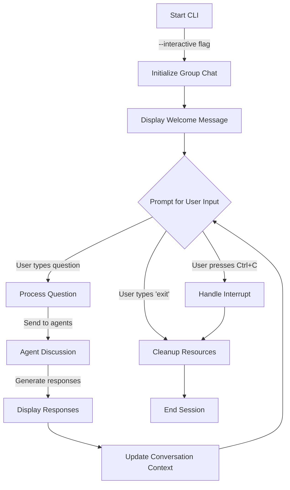
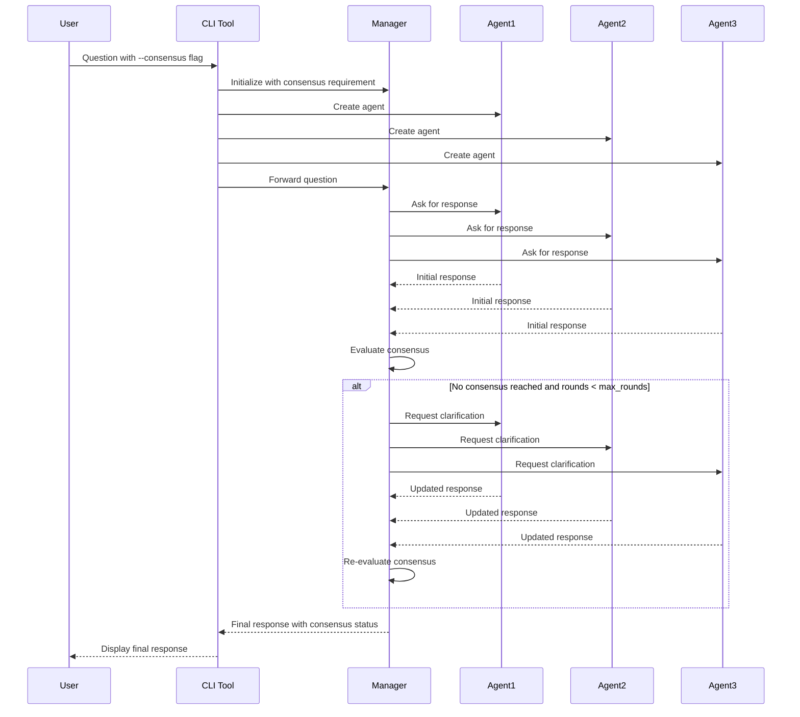

# Multi-Agent LLM Chat CLI Usage Guide

This document provides a comprehensive guide to using the Multi-Agent LLM Chat CLI tool, which allows you to interact with a multi-agent LLM conversation system from the command line.

## Table of Contents

- [Overview](#overview)
- [Installation](#installation)
- [Basic Usage](#basic-usage)
- [Command-line Parameters](#command-line-parameters)
- [Usage Scenarios](#usage-scenarios)
- [Advanced Features](#advanced-features)
- [Example Commands](#example-commands)
- [Workspace System](#workspace-system)
- [Troubleshooting](#troubleshooting)

## Overview

The Multi-Agent LLM Chat CLI provides a command-line interface for interacting with a system of multiple AI agents that collaborate to answer questions and solve problems. Each agent has different capabilities and specializations, working together to provide comprehensive responses.

```mermaid
graph TD
    User[User] -->|"Ask Question"| CLI[CLI Tool]
    CLI -->|"Parse Options"| Config[Configuration]
    Config -->|"Set Parameters"| GroupChat[Group Chat]
    
    subgraph "Agent Management"
        AgentConfig[Agent Configuration] -->|"Load Types"| AgentTypes[(Agent Types)]
        AgentConfig -->|"Create Agents"| Agents[Agent Instances]
    end
    
    CLI -->|"Initialize"| AgentConfig
    GroupChat -->|"Coordinate"| Agents
    
    subgraph "Discussion Process"
        Input[User Input] -->|"Process"| Rounds[Discussion Rounds]
        Rounds -->|"Max Rounds Check"| Consensus{Consensus?}
        Consensus -->|"Yes"| Final[Final Response]
        Consensus -->|"No"| Continue[Continue Discussion]
        Continue --> Rounds
        MaxRounds{Reached Max?} -->|"Yes"| BestResponse[Best Response]
        MaxRounds -->|"No"| Continue
        Rounds --> MaxRounds
        BestResponse --> Final
    end
    
    GroupChat -->|"Manage"| Discussion Process
    Final -->|"Return to"| User
```

## Installation

The CLI tool is included with the LLM-LangGraph project. After installing the project dependencies, you can run the CLI directly:

```bash
# Navigate to the project directory
cd /path/to/llm-langgraph

# Install dependencies using uv
uv pip install -e .

# Run the CLI tool
python src/chat_cli.py --help
```

## Basic Usage

The simplest way to use the CLI is to provide a question directly as a positional argument:

```bash
python src/chat_cli.py "What is the capital of France?"
```

This will create a default set of agents (Assistant, Researcher, and Manager) and have them collaborate to answer your question.

## Command-line Parameters

The CLI supports the following parameters:

| Parameter | Type | Description |
|-----------|------|-------------|
| `--help`, `-h` | Flag | Show help message and exit |
| `--model MODEL` | String | Model to use for the agents (default: llama3) |
| `--question QUESTION` | String | Question to ask the agents (can also be provided as a positional argument) |
| `--interactive` | Flag | Run in interactive mode, allowing multiple questions |
| `--agents AGENTS` | String | Comma-separated list of agent types to use (default: Assistant,Researcher,Manager) |
| `--list-agent-types` | Flag | List all available agent types and exit |
| `--max-rounds MAX_ROUNDS` | Integer | Maximum number of discussion rounds before concluding (default: 3) |
| `--consensus` | Flag | Require agents to reach consensus before concluding |
| `question_pos` | Positional | Question to ask (can be provided directly without --question) |

## Usage Scenarios

### Single Question Mode

Ask a question and get a one-time response:

```bash
python src/chat_cli.py "What is quantum computing?"
```

### Interactive Mode

Start an interactive session where you can ask multiple questions:

```bash
python src/chat_cli.py --interactive
```

The interactive mode process flow is as follows:



### Custom Agent Types

Select specific agent types for specialized tasks:

```bash
python src/chat_cli.py --agents "Math Expert,Coder" "Calculate the factorial of 5"
```

### Control Discussion Rounds

Limit the number of discussion rounds between agents:

```bash
python src/chat_cli.py --max-rounds 1 "What is the best programming language?"
```

### Require Consensus

Force agents to reach a consensus before providing a final answer:

```bash
python src/chat_cli.py --consensus "What are the pros and cons of renewable energy?"
```

When consensus mode is enabled, the following process occurs:



### Combined Parameters

You can combine multiple parameters for more control:

```bash
python src/chat_cli.py --agents "Assistant,Researcher,Critic" --max-rounds 5 --consensus "Explain artificial intelligence"
```

## Advanced Features

### Code Execution

When using the `Coder` and `Code Runner` agent types, the system can execute code in a secure Docker container:

```bash
python src/chat_cli.py --agents "Coder,Code Runner" "Write a Python program to calculate prime numbers"
```

### Workspace System

The CLI uses a workspace system to store and manage files:

- `code/`: Source code files that can be executed
- `data/`: Input data, configuration files, and other resources
- `output/`: Execution results and generated output

All files are stored in the `/Users/erling/code/llm-langgraph/workspaces` directory, with a subdirectory for each group chat.

```mermaid
graph TD
    CLI[CLI Tool] -->|"Creates"| Workspace[Workspace Manager]
    
    Workspace -->|"Creates"| WorkspacePath[/Users/erling/code/llm-langgraph/workspaces]
    WorkspacePath -->|"Contains"| ChatDir[Chat-Specific Directory]
    
    ChatDir -->|"Contains"| CodeDir[code/ Directory]
    ChatDir -->|"Contains"| DataDir[data/ Directory]
    ChatDir -->|"Contains"| OutputDir[output/ Directory]
    
    CodeDir -->|"Stores"| SourceFiles[Source Code Files]
    DataDir -->|"Stores"| InputFiles[Configuration & Data Files]
    OutputDir -->|"Stores"| Results[Execution Results]
    
    subgraph "Code Execution"
        CodeRunner[Code Runner Agent] -->|"Reads"| SourceFiles
        CodeRunner -->|"Executes in"| Docker[Docker Container]
        Docker -->|"Generates"| Output[Execution Output]
        Output -->|"Saved to"| Results
        CodeRunner -->|"May use"| InputFiles
    end
    
    subgraph "File Operations"
        ListFiles[List Workspace Files]
        ReadFile[Read Workspace File]
        SaveFile[Save Workspace File]
    end
    
    CLI -->|"Can Invoke"| ListFiles
    CLI -->|"Can Invoke"| ReadFile
    CLI -->|"Can Invoke"| SaveFile
    
    ListFiles -->|"Interacts with"| ChatDir
    ReadFile -->|"Interacts with"| ChatDir
    SaveFile -->|"Interacts with"| ChatDir
```

## Example Commands

Here are some example commands that have been tested with the CLI:

1. **Get help:**
   ```bash
   python src/chat_cli.py --help
   ```

2. **List available agent types:**
   ```bash
   python src/chat_cli.py --list-agent-types
   ```

3. **Ask a simple question:**
   ```bash
   python src/chat_cli.py "What is the capital of France?"
   ```

4. **Use the question flag:**
   ```bash
   python src/chat_cli.py --question "What is the difference between a list and a tuple in Python?"
   ```

5. **Use specialized agents:**
   ```bash
   python src/chat_cli.py --agents "Math Expert,Coder" "Calculate the factorial of 5"
   ```

6. **Enable consensus mode:**
   ```bash
   python src/chat_cli.py --consensus "What are the pros and cons of renewable energy?"
   ```

7. **Limit discussion rounds:**
   ```bash
   python src/chat_cli.py --max-rounds 1 --agents "Assistant,Researcher,Critic" "What is quantum computing?"
   ```

8. **Run in interactive mode:**
   ```bash
   python src/chat_cli.py --interactive --model llama3
   ```

9. **Combine code generation and execution:**
   ```bash
   python src/chat_cli.py --agents "Coder,Code Runner" "Write a simple Python program to calculate the Fibonacci sequence up to 20"
   ```

## Troubleshooting

### Common Issues

1. **Ollama Connection Issues:**
   If you see an error connecting to Ollama, make sure the Ollama service is running with `ollama serve`.

2. **Model Not Found:**
   If a model is not found, make sure it's installed in Ollama with `ollama pull modelname`.

3. **Agent Type Not Found:**
   If an agent type is not found, check the available agent types with `--list-agent-types`.

### Environment

For optimal performance, ensure you're using Python 3.11 or higher and have all dependencies installed as specified in the `pyproject.toml` file.
