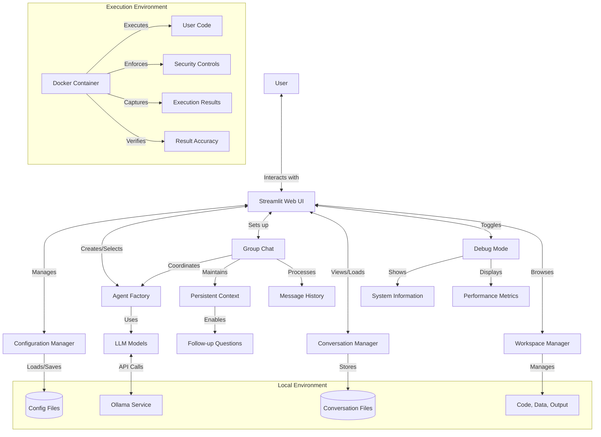
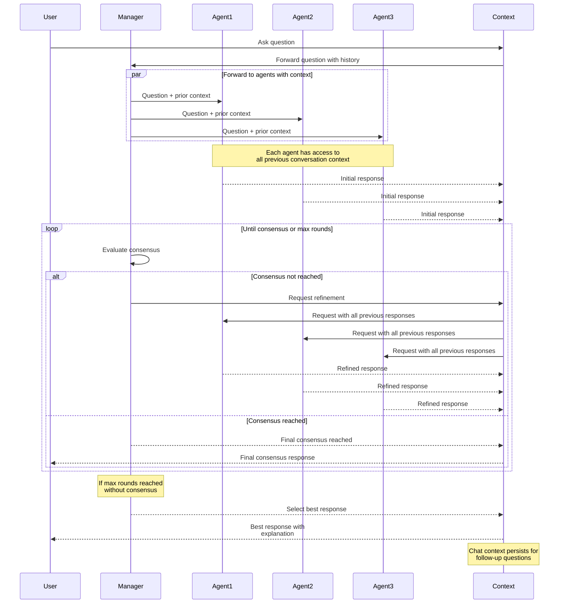
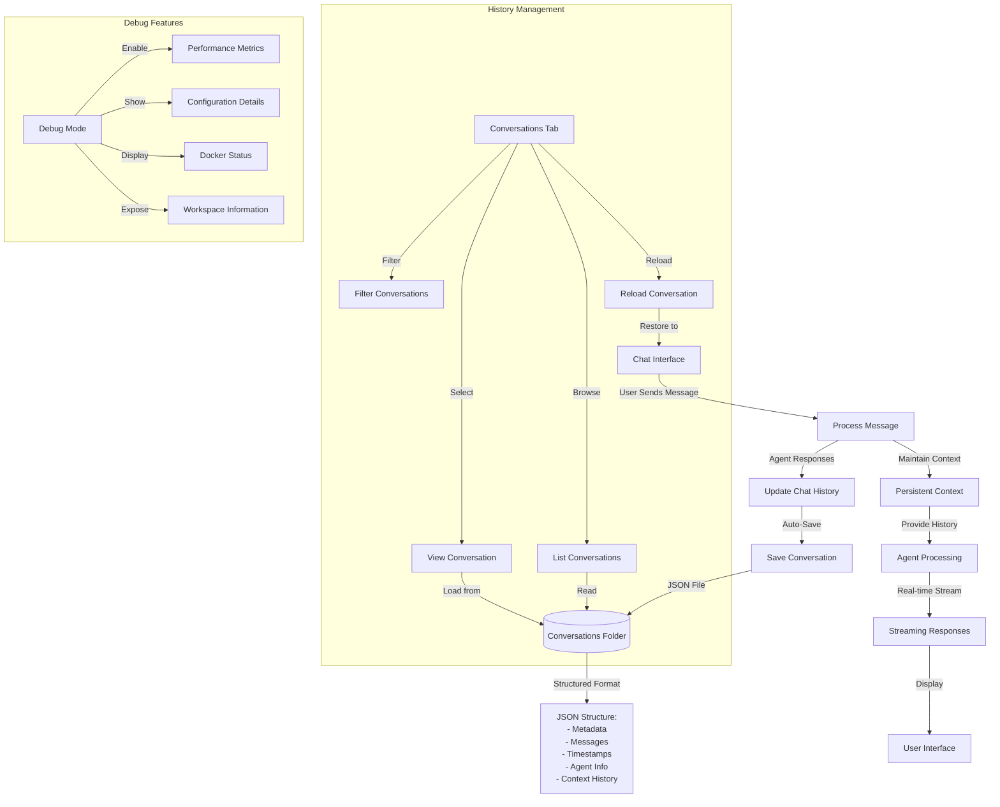
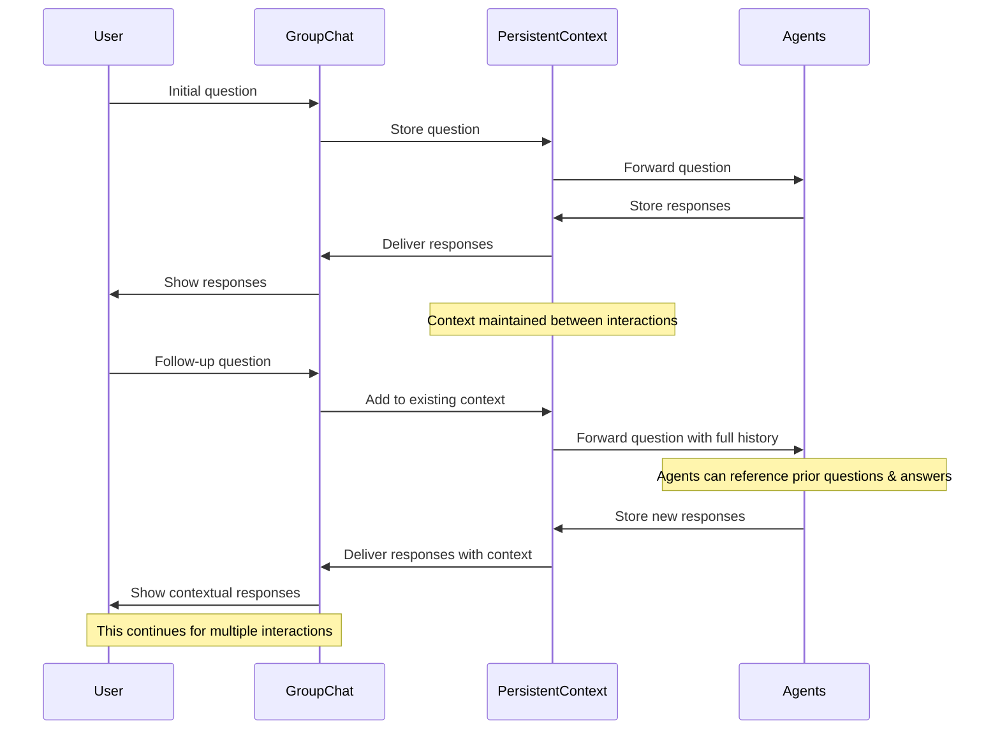
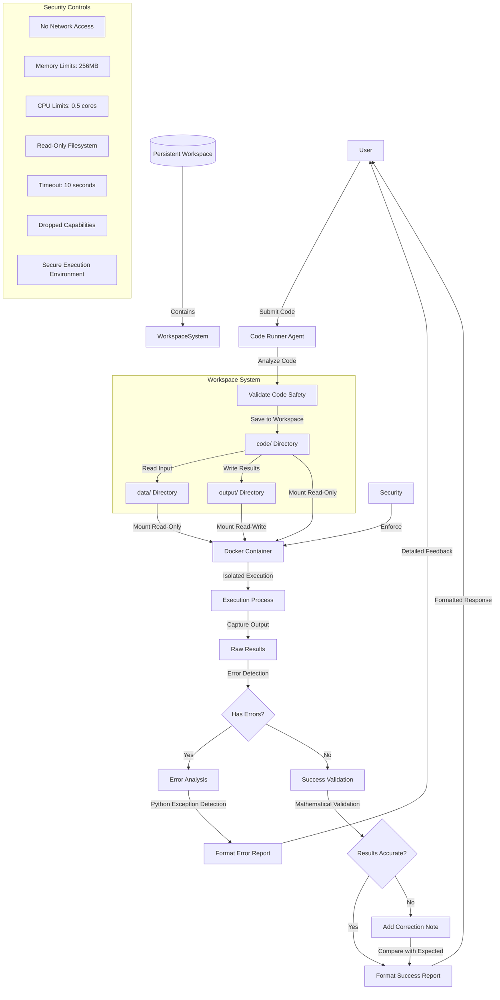

# Multi-Agent LLM Chat with GroupChat Functionality

A Streamlit application that leverages LangGraph to create multi-agent conversations with local LLM models served by Ollama. This application allows you to create and configure multiple AI agents with different personalities and capabilities, then have them collaborate in a group chat to solve problems.

> 📘 **For Developers**: For technical details and implementation notes, see [LLM_CONTEXT.md](LLM_CONTEXT.md)  
> 🔧 **New Users**: For detailed installation instructions across all platforms, see [INSTALL.md](INSTALL.md)

## Features

- **Multiple Agent Types**: Create specialized agents (Assistant, Researcher, Coder, Math Expert, Critic, or Custom)
- **Custom Model Integration**: Pull and configure custom Ollama models directly from the UI
- **Consensus-Based Discussion**: Agents can engage in multi-round discussions until reaching consensus
- **Group Chat Manager**: A designated agent evaluates when consensus has been reached
- **Local LLM Integration**: Uses Ollama to run models completely locally
- **Agent Memory**: Conversation history for contextual responses
- **Persistent Agents & Group Chats**: Agents and group chat configurations are automatically saved and can be reused across sessions
- **Configuration Management**: Save and load agent configurations
- **Conversation History**: All conversations are automatically saved to the 'conversations' folder and can be reloaded later
- **Dynamic Tools**: Different tools assigned based on agent type
- **Debug Mode**: Enable detailed logging and performance metrics
- **Secure Docker Execution**: All code is executed exclusively in isolated Docker containers with advanced security controls
- **Enhanced Error Reporting**: Comprehensive error detection and reporting for Python exceptions and other execution issues
- **Real-time Response Streaming**: See agent responses as they're generated for better interactivity
- **Result Verification**: Code Runner agent verifies mathematical results against known values
- **Persistent Workspace System**: Each group chat has its own workspace with code, data, and output folders

## System Architecture



## Prerequisites

- Ollama installed and running
- Python >= 3.13
- uv >= 0.5.0
- Docker >= 25.0.2 (Colima recommended for macOS users)
- VS Code or another Python IDE (recommended)

For detailed installation instructions for all prerequisites on macOS, Linux, and Windows, please refer to the [INSTALL.md](INSTALL.md) guide.

## Setup

### 1. Ensure Ollama is running

```bash
ollama serve
```

### 2. Pull recommended models

```bash
ollama pull llama3
ollama pull mistral
ollama pull codellama
```

### 3. Install dependencies

Please refer to the [INSTALL.md](INSTALL.md) guide for detailed installation instructions, including setting up virtual environments and installing dependencies.

## Running the Application

Use the following command to run the application. This will automatically set up a virtual environment and install all required packages before running:

```bash
uv run streamlit run src/app.py
```

To stop the application:
```bash
pkill -f "streamlit run" || echo "No running Streamlit processes found"
```

### Convenience Scripts

For easier startup and shutdown, you can use the provided scripts:

```bash
# Start the application
./run.sh

# Stop the application
./stop.sh
```

## Using the Application

1. **Connect to Ollama**: First, ensure Ollama is running and click "Connect to Ollama" in the sidebar
2. **Pull Custom Models** (Optional): Use the "Pull Custom Models" section in the sidebar to add new Ollama models
   - Enter the model name as it appears in Ollama (e.g., `llama3:latest`, `wizardcoder:python`)
   - Add optional display name, description, and tags for better organization
   - The model will be pulled from Ollama and added to models.json for future use
3. **Create Agents**: Configure and create agents with different specialties
4. **Setup Group Chat**: Select multiple agents to participate in a group chat
   - **Enable Consensus Mode**: Check "Require Consensus" to have agents discuss until agreement
   - **Set Discussion Rounds**: Choose how many rounds of discussion to allow (1-99)
   - **Add a Critic or Manager**: For best results in consensus mode, include a Critic or create a Manager agent
5. **Chat Interface**: Interact with your agents through the main chat interface
6. **Access Saved Conversations**: Open the Group Chat Management section and go to the Conversations tab to browse, filter, and reload past conversations
7. **Save Configuration**: Save your agent configurations for future use

## Agent Types

- **Assistant**: General-purpose helpful assistant
- **Researcher**: Specializes in gathering and analyzing information
- **Coder**: Focuses on programming and code-related tasks
- **Math Expert**: Specializes in mathematical problem solving
- **Critic**: Provides critical analysis and feedback
- **Code Runner**: Executes and tests code securely in Docker containers
- **Custom**: Create your own agent with a custom prompt

## Consensus-Based Discussions

The application supports a powerful consensus mechanism that allows agents to engage in multi-round discussions:



- **Discussion Rounds**: Agents refine their thoughts over multiple rounds of conversation
- **Consensus Evaluation**: A Manager or Critic agent evaluates when consensus has been reached
- **Adaptive Responses**: Agents modify their responses based on other agents' input
- **Maximum Round Limit**: Set a cap on discussion rounds (1-99) before concluding

This approach is particularly effective for complex questions that benefit from multiple perspectives and collaborative problem-solving. The consensus feature works best with at least 3 agents including a Critic or Manager agent.

## Advanced Features

- **Custom Prompts**: Define your own agent personalities
- **Tool Integration**: Agents have access to different tools based on their type
- **Docker Code Execution**: Safely test and run code in isolated containers
- **Performance Metrics**: Track response times in debug mode

## Conversation Management

The application includes a robust conversation management system:



- **Automatic Saving**: All conversations are automatically saved as JSON files in the 'conversations' folder
- **Conversation Browser**: Browse and filter past conversations by group chat name
- **Metadata Storage**: Each conversation file includes metadata about participants and settings
- **Conversation Reloading**: Reload any past conversation to continue where you left off
- **Preview Feature**: Preview conversation content before loading

All saved conversations are accessible through the "Conversations" tab in the Group Chat Management section, where you can filter, browse, and reload past discussions.

## Conversation Context Flow

The system maintains conversation context between user interactions, allowing for natural follow-up questions:



- **Context Preservation**: All user questions and agent responses are maintained in persistent memory
- **Reference Resolution**: Follow-up questions can reference earlier parts of the conversation
- **Contextual Understanding**: Agents can understand phrases like "it", "that", or "the code" in context
- **Session Persistence**: Context is maintained even if the connection is temporarily lost

## Docker Code Runner

The application includes a Code Runner agent that safely executes code inside Docker containers with improved error reporting and result verification:



### Features

- **Supported Languages**: Python, JavaScript, and Go
- **Secure Execution**: All code runs in isolated, constrained Docker containers
- **Security Controls**: No network access, limited resources, read-only filesystem
- **Runtime Management**: List and terminate running code executions
- **Enhanced Error Detection**: Comprehensive detection of Python exceptions and other execution issues
- **Result Verification**: Mathematical results are verified against known values (Pi, e, etc.)
- **Detailed Feedback**: Execution results include accuracy checks and suggested improvements
- **Real-time Streaming**: See execution results as they're generated

### Workspace System

Each group chat has a persistent workspace with three directories:

- **code/**: For source code files that can be executed
- **data/**: For input data, configuration files, and other resources
- **output/**: For execution results and generated outputs

The workspace system ensures that files persist between conversations, allowing for iterative development and testing.

### Requirements

- Docker must be installed and running on your system (Colima recommended for macOS users)
- For macOS users, Colima provides better performance and no licensing restrictions:
  ```bash
  # Install and configure Colima with appropriate resources
  brew install colima docker docker-compose
  colima start --cpu 4 --memory 8 --disk 20
  ```
- The application automatically detects and uses your Docker installation
- All paths are dynamically managed by the workspace system for maximum portability

### Usage

1. Create a Code Runner agent in the Agent Configuration section
2. Include the agent in a group chat
3. Submit code to run by asking the agent to execute it
4. Receive results, error analysis, and verification of mathematical accuracy