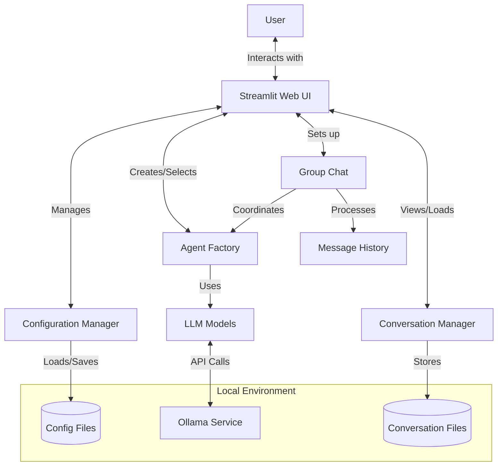
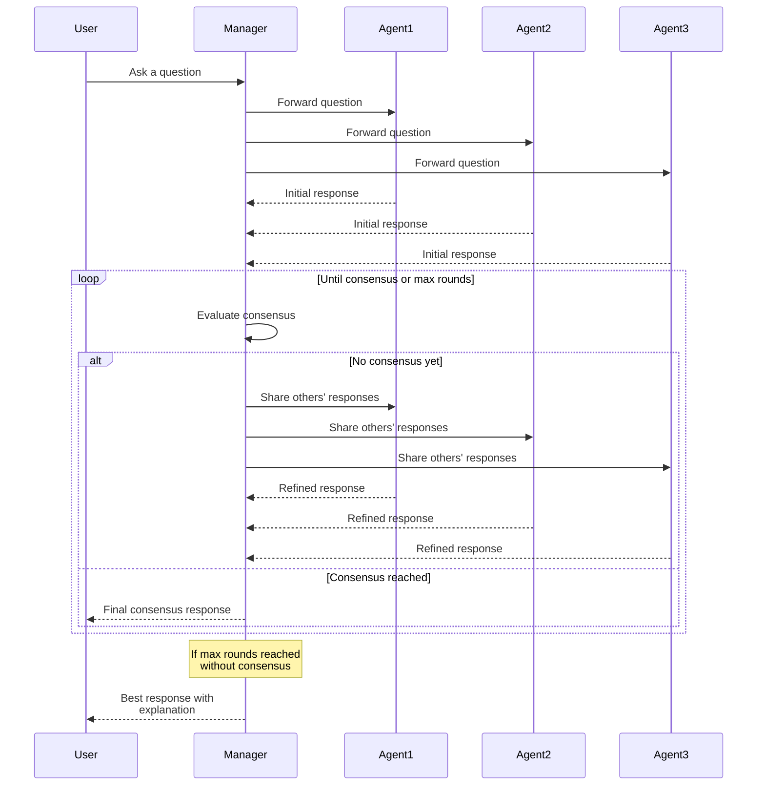
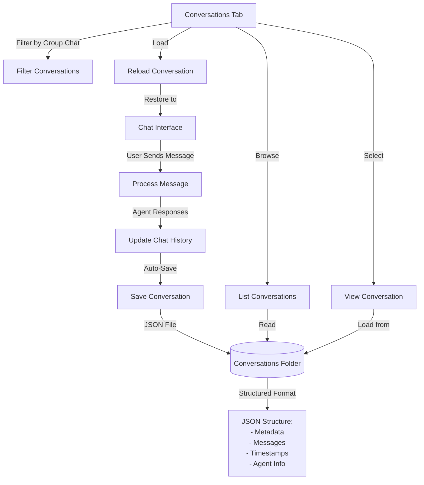

# Multi-Agent LLM Chat with GroupChat Functionality

A Streamlit application that leverages LangGraph to create multi-agent conversations with local LLM models served by Ollama. This application allows you to create and configure multiple AI agents with different personalities and capabilities, then have them collaborate in a group chat to solve problems.

> 📘 **For Developers**: For more technical details and implementation notes, see [LLM_CONTEXT.md](LLM_CONTEXT.md)

## Features

- **Multiple Agent Types**: Create specialized agents (Assistant, Researcher, Coder, Math Expert, Critic, or Custom)
- **Consensus-Based Discussion**: Agents can engage in multi-round discussions until reaching consensus
- **Group Chat Manager**: A designated agent evaluates when consensus has been reached
- **Local LLM Integration**: Uses Ollama to run models completely locally
- **Agent Memory**: Conversation history for contextual responses
- **Persistent Agents & Group Chats**: Agents and group chat configurations are automatically saved and can be reused across sessions
- **Configuration Management**: Save and load agent configurations
- **Conversation History**: All conversations are automatically saved to the 'conversations' folder and can be reloaded later
- **Dynamic Tools**: Different tools assigned based on agent type
- **Debug Mode**: Enable detailed logging and performance metrics

## System Architecture



## Prerequisites

- Ollama installed and running
- Python >= 3.13
- uv >= 0.5.0

## Setup

### 1. Ensure Ollama is running

```bash
ollama serve
```

### 2. Pull recommended models

```bash
ollama pull llama3
ollama pull devstral
ollama pull mistral
ollama pull codellama
```

### 3. Install dependencies

```bash
uv init llm-langgraph2 && cd llm-langgraph2
uv add streamlit langchain-core langchain-community langgraph ollama
```

## Running the Application

```bash
uv run streamlit run src/app.py
```

To stop the app:
```bash
pkill -f "streamlit run" || echo "No running Streamlit processes found"
```

## Using the Application

1. **Connect to Ollama**: First, ensure Ollama is running and click "Connect to Ollama" in the sidebar
2. **Create Agents**: Configure and create agents with different specialties
3. **Setup Group Chat**: Select multiple agents to participate in a group chat
   - **Enable Consensus Mode**: Check "Require Consensus" to have agents discuss until agreement
   - **Set Discussion Rounds**: Choose how many rounds of discussion to allow (1-99)
   - **Add a Critic or Manager**: For best results in consensus mode, include a Critic or create a Manager agent
4. **Chat Interface**: Interact with your agents through the main chat interface
5. **Access Saved Conversations**: Open the Group Chat Management section and go to the Conversations tab to browse, filter, and reload past conversations
6. **Save Configuration**: Save your agent configurations for future use

## Agent Types

- **Assistant**: General-purpose helpful assistant
- **Researcher**: Specializes in gathering and analyzing information
- **Coder**: Focuses on programming and code-related tasks
- **Math Expert**: Specializes in mathematical problem solving
- **Critic**: Provides critical analysis and feedback
- **Custom**: Create your own agent with a custom prompt

## Consensus-Based Discussions

The application supports a powerful consensus mechanism that allows agents to engage in multi-round discussions:



- **Discussion Rounds**: Agents refine their thoughts over multiple rounds of conversation
- **Consensus Evaluation**: A Manager or Critic agent evaluates when consensus has been reached
- **Adaptive Responses**: Agents modify their responses based on other agents' input
- **Maximum Round Limit**: Set a cap on discussion rounds (1-99) before concluding

This approach is particularly effective for complex questions that benefit from multiple perspectives and collaborative problem-solving. The consensus feature works best with at least 3 agents including a Critic or Manager agent.

## Advanced Features

- **Custom Prompts**: Define your own agent personalities
- **Tool Integration**: Agents have access to different tools based on their type
- **Performance Metrics**: Track response times in debug mode

## Conversation Management

The application includes a robust conversation management system:



- **Automatic Saving**: All conversations are automatically saved as JSON files in the 'conversations' folder
- **Conversation Browser**: Browse and filter past conversations by group chat name
- **Metadata Storage**: Each conversation file includes metadata about participants and settings
- **Conversation Reloading**: Reload any past conversation to continue where you left off
- **Preview Feature**: Preview conversation content before loading

All saved conversations are accessible through the "Conversations" tab in the Group Chat Management section, where you can filter, browse, and reload past discussions.